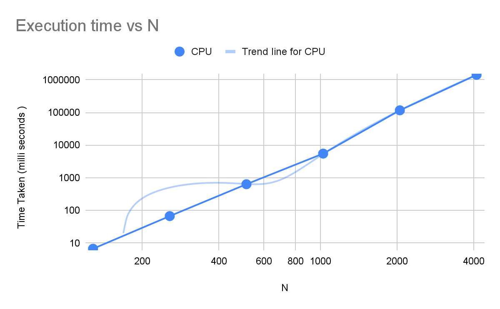
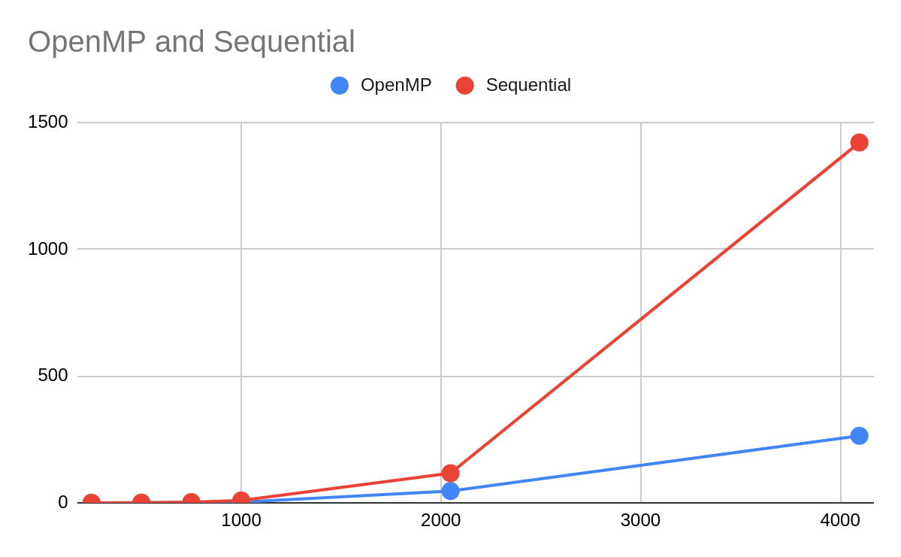
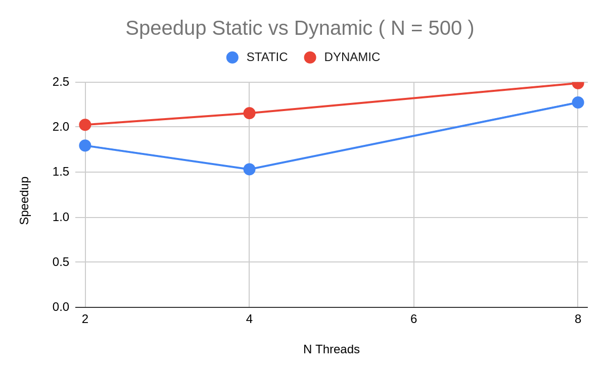
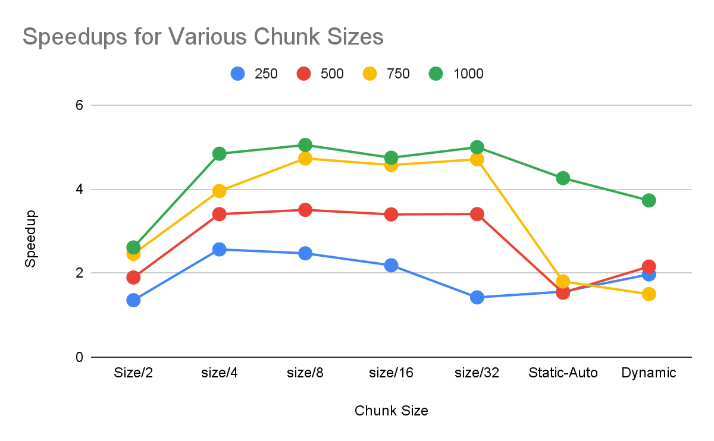
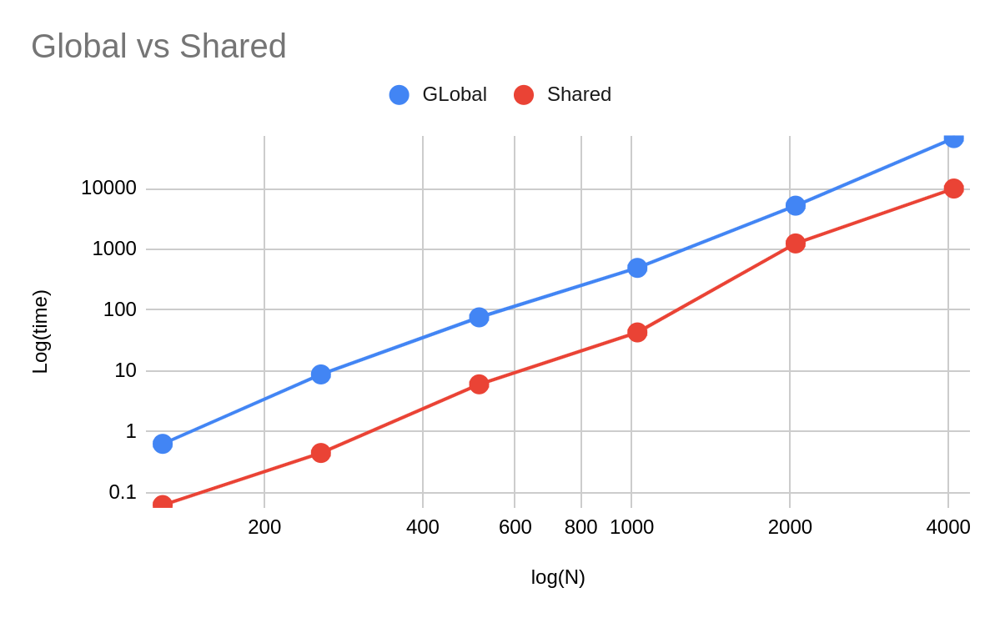
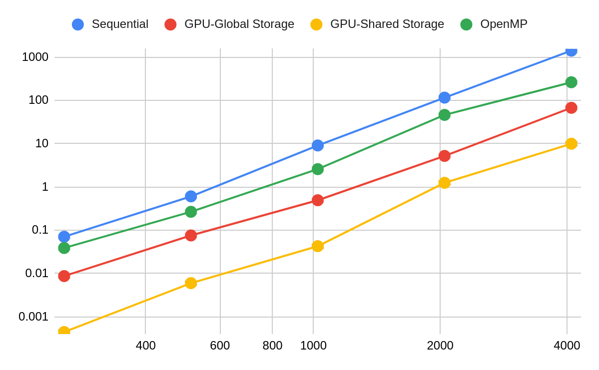
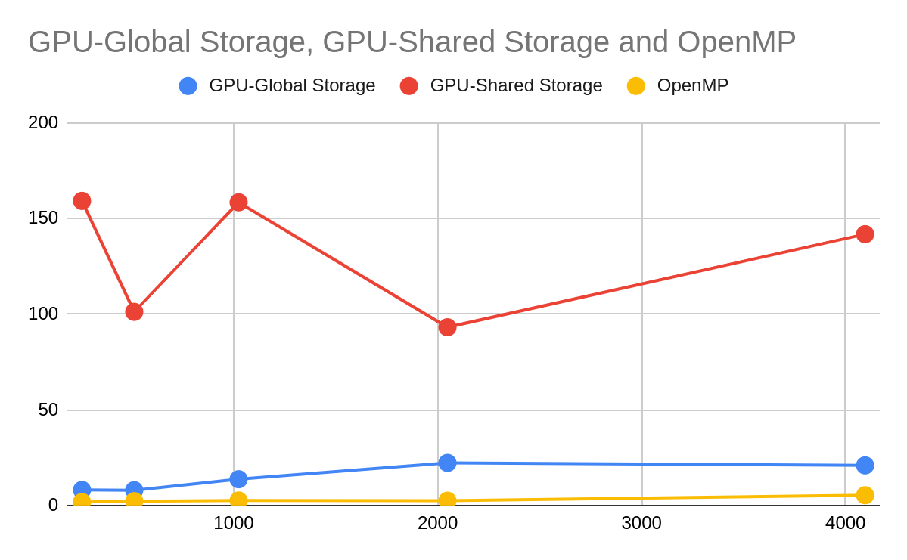

# GPU-OpenMP-MatixMultiplicaiton
---

A comparative study of matrix multiplication using Sequential, OpenMP, GPU_Shared and GPU Global Memory. 


* Sequential Code
* OpenMP
    * Static Scheduling 
    * Dynamic Scheduling
* GPU - CUDA
    * Global Memory Access
    * Shared Memory Access


## Experimentation Parameters
---

We will perform matrix multiplication using the following sizes of matrix to observe the efficiency and the scale up of the current model. 

* 1024 * 1024
* 2048 * 2048
* 4096 * 4096


|  			S.No 		     |  			Device 		     |  			Specs 		     |
|---|---|---|
|  			1 		     |  			CPU 		     |  			Intel(R) Core(TM) i7-10700K 		     |
|  			2 		     |  			Num processor 		     |  			8 		     |
|  			3 		     |  			Num Threads 		     |  			16 		     |
|  			4 		     |  			L1 Cache 		     |  			32 KB 		     |
|  			5 		     |  			L2 Cache 		     |  			256 KB 		     |
|  			6 		     |  			L3 Cache  			 		        |  			16 MB 		     |

|  			S.No 		     |  			Device 		     |  			Specs 		     |
|---|---|---|
|  			1 		     |  			GPU Model 		     |  			Quadro P400 		     |
|  			2 		     |  			Device Memory 		     |  			2GB 		     |
|  			3 		     |  			NVIDIA Cuda Cores 		     |  			1792 		     |
|  			4 		     |  			Max power Consumption 		     |  			105 W 		     |


## CPU - Sequential 
---

```
for( int i =0 ; i < N; i++)
   {
       for ( int j=0 ; j < N; j++)
       {
           C[i*N + j] = 0;
           for ( int k=0 ; k < N; k++)
           {
               C[i*N + j] += A[i*N + k] * B[k*N + j];
           }
       }
   }
```



Order of complexity is O(N^3) , since the slope of the line is approximately close to 3. 

## OpenMP
---

```
void matMul_parallel(double** A, double** B , double** C)
{
   #pragma omp parallel for shared(A,  B, C) num_threads(N_THREADS)
   for (int i = 0; i < SIZE ; i++ )
       for (int j = 0; j < SIZE ; j++ )
           for (int k = 0; k < SIZE ; k++ )
               C[i][j] += A[i][k]*B[k][j];

}
```




### Static  vs Dynamic Scheduling
---




### Effect of Chunk Sizes
---



### Observation

* The Static scheduling with proper chink size seems to provide higher speed ups
* However,it is difficult to determine proper chunk size which could produce speedups for all sizes
* So dynamic scheduling is preferred in those cases of uncertainties. 

## CUDA
---


### GPU Non Shared vs Shared Memory Mat-Mat Multiplication




## Final Comparision
---

### Time Taken





### Speed Ups


